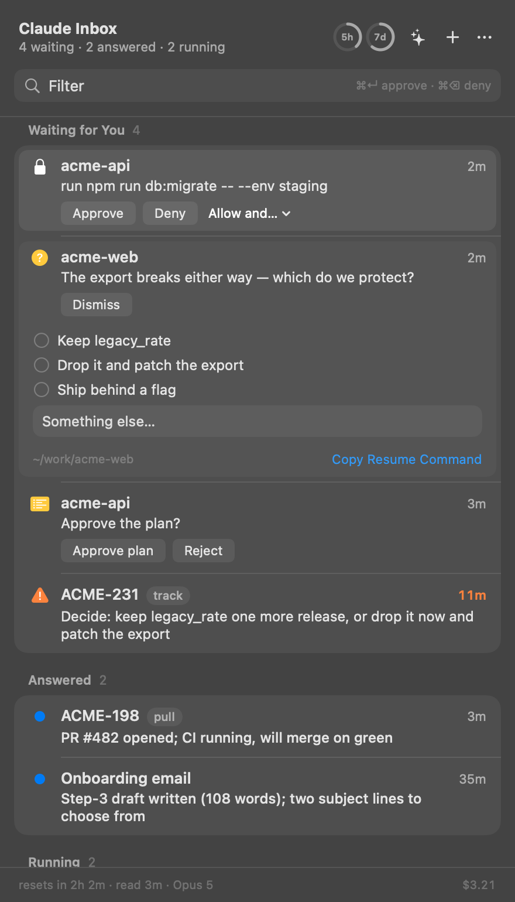
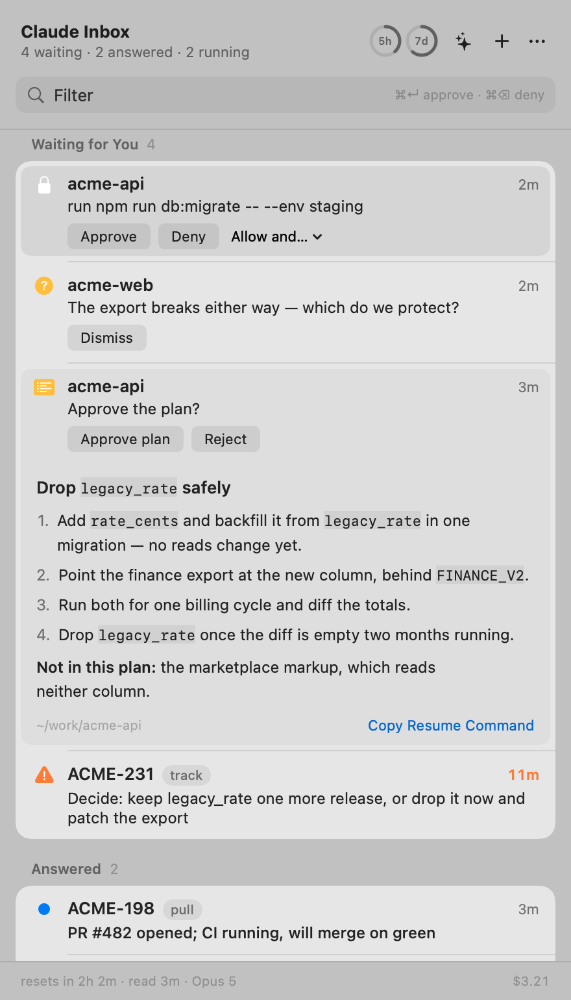

# Claude Inbox

Every Claude Code session on your Mac that is waiting for you, in the menu bar.
Approve, decide, read the answer, reply — without finding the terminal.

<p align="center">
  
</p>

- [Install](#install)
- [Update](#update)
- [What it does](#what-it-does)
- [Keyboard](#keyboard)
- [How it works](#how-it-works)
- [What it asks a model, and on whose account](#what-it-asks-a-model-and-on-whose-account)
- [Build and test](#build-and-test)
- [Limits](#limits)

## Install

macOS 15+, Claude Code signed in. No terminal needed.

1. **Download** [`ClaudeInbox.dmg`](https://github.com/andreyblck/claude-inbox/releases/latest), drag the app into Applications.
2. **First launch:** the app is unsigned, so macOS says *"Apple could not verify ClaudeInbox is free of malware"*. Click Done → **System Settings → Privacy & Security → Open Anyway**. Once.
   Terminal alternative: `xattr -d com.apple.quarantine /Applications/ClaudeInbox.app`.
3. **Click Install Bridge** in the panel (menu bar icon or **⌥Space**). Allow notifications when asked.

<p align="center">
  
</p>

Install Bridge adds hooks to `~/.claude/settings.json` (backed up first) and wraps your status line if you have one. Sessions already running appear on their next turn. Remove: **… → Uninstall Bridge**, trash the app.

From source: `git clone https://github.com/andreyblck/claude-inbox.git && cd claude-inbox && ./app/package.sh` — builds a universal binary into /Applications; needs the Xcode command line tools.

## Update

The app does not check for updates by itself — it never talks to anything but
your own machine, and a background version check would end that. So it tells you
what it is and lets you compare: **… → Claude Inbox 0.1.5**, and **Check for
Updates…** opens the [releases page](https://github.com/andreyblck/claude-inbox/releases/latest).

To update, download the new `.dmg` and drag it over the old app. Three things
worth knowing:

- **The bridge comes with it.** The hooks live inside the app bundle, so
  replacing the app replaces them — nothing to reinstall, and no stale hook
  pointing at a version you deleted. Re-run **Install Bridge** only if the panel
  says it is not connected.
- **Gatekeeper asks again.** Each new unsigned build is new to macOS: Privacy &
  Security → Open Anyway, once per update.
- **Quit it first**, or the old copy will be running while you replace it —
  **… → Quit Claude Inbox**, then drag. (`./app/package.sh` does this for you.)

From source: `git pull && ./app/package.sh`. Sessions already running keep the
hooks they started with and pick up the new ones on their next turn.

## What it does

Four kinds of row, and each one is answered where you read it.

### A question, with its options on the card

<p align="center">
  
</p>

A session that stops to ask you something shows the question itself — not "a
session needs you". One tap on an option answers it and the session carries on.
The field underneath is for the answer that was not on the list.

### A plan, read where you read everything else

<p align="center">
  
</p>

The whole plan, as rendered markdown, with the decision on the same card. Light
and dark follow the system — this is the same panel.

### A permission, and the grant that stops the next dozen

<p align="center">
  
</p>

The exact command, then Approve or Deny. **Allow and…** offers what Claude Code
itself suggests — trust this directory, accept edits, allow this tool — so one
press answers this request and the ones after it. Approve and Deny are on the
notification too.

### An answer, without going to find it

<p align="center">
  
</p>

What you asked, then everything the session said since — rendered, scrollable,
selectable. When the reply asks you something, up to three likely answers appear
as chips: a tap drafts one into the note field, and the field sends it back into
the running session. Unread answers carry the blue dot Mail uses; running
sessions show the three dots of someone typing.

Rows are named after the tracker issue the session works on (`ACME-231`, read
from a Linear link or a bare key in what you typed), else a short generated name
("Onboarding email"), else the session's own name. **✦** in the header writes one
paragraph across every session; **+** starts a new one without a terminal;
right-click a row for Linear, the terminal, copy, or rename.

## Keyboard

| | |
|---|---|
| **⌥Space** | open / close |
| type | filter by issue, name, or text |
| **↑ ↓ ↵** | move, open |
| **⌘↵ / ⌘⌫** | approve / deny the focused permission — a question is answered by its options, never by ⌘↵ |
| **⌘1…9** | open the n-th waiting row |
| **⌘L** | open the issue in Linear |
| **⌘T** | bring the session's terminal to the front |
| **Esc** | clear the filter, then close |

## How it works

No daemon, no server, no API key. Hooks write files; the app reads them.

```
bridge/   Claude Code hooks — bash + /usr/bin/jq. Shipped inside the app, installed at user scope.
app/      Swift + SwiftUI menu bar app.
spec/     The rules the app is ported from, in TypeScript with tests. Rules change here first.

~/.claude/inbox/            mode 0700
  sessions/<id>.json        state, step, issue, what was asked, what it said   (hook-session.sh)
  pending/<req>.json        a permission waiting for a verdict + the pid holding it (hook-permission.sh)
  verdicts/<req>.json       the verdict                                          (app)
  usage/<config>.json       rate limits, context, cost                           (statusline.sh)
  labels.json, asks.json    model answers, cached so each is asked once          (app)
```

- **Permissions:** the `PermissionRequest` hook holds the request open and polls for a verdict file; the app writes one; the hook prints the decision. No verdict in 20 s → the hook goes silent and the terminal prompts as usual. App not running → no wait at all.
- **Questions and plans wait longer** — 300 s, because they are read and thought about, not glanced at. Nothing is lost by waiting: Claude Code shows its own dialog at the same time and whoever answers first wins. Answer it in the terminal and the row disappears from the panel on the session's next event.
- **Rule for every hook:** never break a session. Any error → exit 0, print nothing. The bridge can only add a faster path, never remove the normal one.
- **Two sources merged by freshest observation:** Claude Code's own session registry (who is alive) and the hooks (what they want). Neither alone is right.
- **A row's line**, in order: the model's sentence before its last action → what you asked → Claude Code's title → the tool in use. Blocked rows lead with the tool call they are stopped on.

## What it asks a model, and on whose account

Two things a transcript cannot say are asked of the `claude` on your machine — your account, Haiku, one small call each, cached on disk, never on the way to a redraw:

| | When | Answer |
|---|---|---|
| **Name** | once per session with no issue key | 1–3 words: "GSC", "Onboarding email" |
| **Reading** | once per finished turn | YES/NO — is it waiting for *you*? — one line, up to three likely replies (a tap drafts; never sends) |

Both can be turned off — **… → Name sessions and read turns** — and the menu shows how many calls were made today. Waiting for CI, agents or timers is NO: the session wakes itself. Answers come in the session's language; the calls run with your Claude Code settings left out (`--setting-sources local`), so a "reply in Russian" preference does not decide the language of a line about an English session. Nothing leaves the machine that Claude Code was not already sending.

## Build and test

```bash
cd app && swift build                                  # debug build
./app/package.sh [--dmg]                               # universal release → /Applications [+ disk image]
cd spec && npm install && npm test                     # the rules — 97 cases
bridge/selftest.sh                                     # hooks against a throwaway inbox
bridge/install-test.sh                                 # install.sh against throwaway config dirs
bridge/e2e.sh [--deny|--silent|--grant]                # a REAL `claude -p` session blocks; a verdict file decides it
app/.build/debug/ClaudeInbox --dump                    # what the panel would show, as text
app/.build/debug/ClaudeInbox --snapshot out.png [--light] [--open N]   # the panel drawn to a file
bridge/demo.sh [--clear]                               # invented sessions (the screenshots above)
```

`e2e.sh` is the test that matters: it drives real Claude Code. Output that fails Claude Code's schema is dropped *quietly* — a bad decision shape looks exactly like a timeout, and a malformed grant is ignored with a warning nobody sees. `--grant` is the only test that can catch the second: it asserts a second tool call is never asked about. The Swift port has no test target; `--dump` diffs it against `spec/` on the same data and prints how many records the decoder refused, because a silent drop once made a broken build look like a quiet machine.

## Limits

- Unsigned: Gatekeeper's Open Anyway once per update. A Developer ID would remove it; nothing else changes.
- `install.sh` uses `/usr/bin/python3`, i.e. the Xcode command line tools (present if you have `git`).
- Answering a question from the panel is covered by the spec and by `bridge/selftest.sh`, but not end to end: `AskUserQuestion` only exists in an interactive session, so `claude -p` cannot raise one and the TUI does not take pty input reliably enough to assert on.
- ⌘T raises the terminal app, not the tab — Warp and most others give no way to ask for one.
- Verified against Claude Code 2.1.278; hook payloads recorded in `spikes/README.md`.

MIT — [LICENSE](LICENSE).
