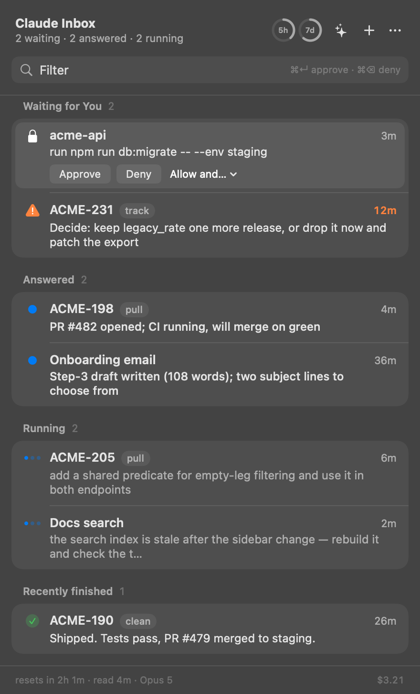
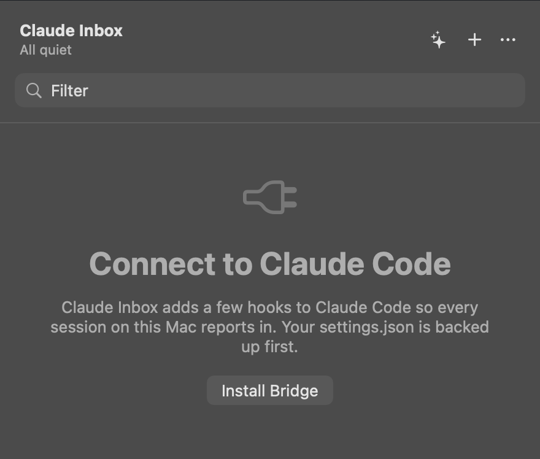
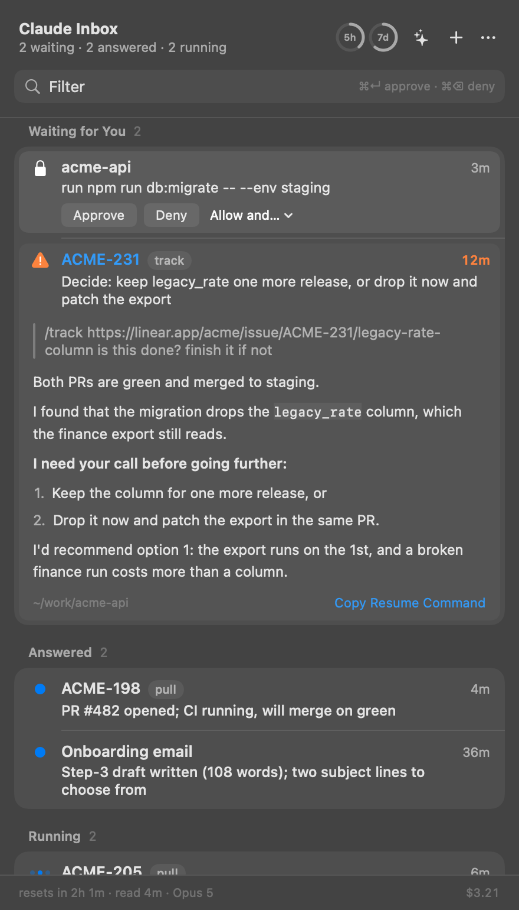
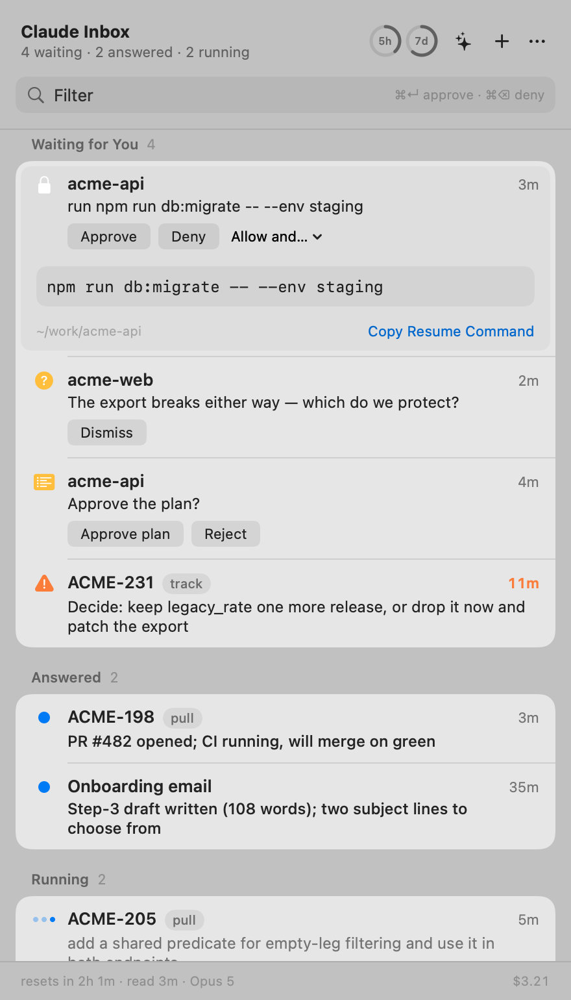

# Claude Inbox

Every Claude Code session on your Mac that is waiting for you, in the menu bar.
Approve, decide, read the answer, reply — without finding the terminal.

<p align="center">
  
</p>

- [Install](#install)
- [What it does](#what-it-does)
- [Keyboard](#keyboard)
- [How it works](#how-it-works)
- [What it asks a model, and on whose account](#what-it-asks-a-model-and-on-whose-account)
- [Build and test](#build-and-test)
- [Limits](#limits)

## Install

macOS 15+, Claude Code signed in. No terminal needed.

1. **Download** [`ClaudeInbox.dmg`](https://github.com/andreyblck/claude-inbox/releases/latest), drag the app into Applications.
2. **First launch:** the app is unsigned, so macOS says *"Apple could not verify ClaudeInbox is free of malware"*. Click Done → **System Settings → Privacy & Security → Open Anyway**. Once.
   Terminal alternative: `xattr -d com.apple.quarantine /Applications/ClaudeInbox.app`.
3. **Click Install Bridge** in the panel (menu bar icon or **⌥Space**). Allow notifications when asked.

<p align="center">
  
</p>

Install Bridge adds hooks to `~/.claude/settings.json` (backed up first) and wraps your status line if you have one. Sessions already running appear on their next turn. Remove: **… → Uninstall Bridge**, trash the app.

From source: `git clone https://github.com/andreyblck/claude-inbox.git && cd claude-inbox && ./app/package.sh` — builds a universal binary into /Applications; needs the Xcode command line tools.

## What it does

<p align="center">
  
</p>

| Section | What lands there |
|---|---|
| **Waiting for You** | permission requests (Approve / Deny on the row and on the banner); turns that ended by asking you something, with the ask in one line and one-tap replies |
| **Answered** | finished turns, unread ones with a blue dot; open a row for the whole answer as rendered markdown |
| **Running** | what each session is doing right now, in the model's own words |

- Rows are named after the tracker issue the session works on (`ACME-231`, from a Linear link or a bare key in your prompt), else a short generated name ("Docs search"), else the session name.
- Notes go back into a running session. They arrive as a message from a peer session, not as you — Claude Code frames them that way so nothing outside the terminal can impersonate you.
- **✦** digests everything at once; **+** starts a session from the panel; right-click a row for Linear, terminal, copy, rename.
- Native: light/dark, your accent colour, system fonts and symbols.

<p align="center">
  
</p>

## Keyboard

| | |
|---|---|
| **⌥Space** | open / close |
| type | filter by issue, name, or text |
| **↑ ↓ ↵** | move, open |
| **⌘↵ / ⌘⌫** | approve / deny the focused permission |
| **⌘1…9** | open the n-th waiting row |
| **⌘L** | open the issue in Linear |
| **⌘T** | bring the session's terminal to the front |
| **Esc** | clear the filter, then close |

## How it works

No daemon, no server, no API key. Hooks write files; the app reads them.

```
bridge/   Claude Code hooks — bash + /usr/bin/jq. Shipped inside the app, installed at user scope.
app/      Swift + SwiftUI menu bar app.
spec/     The rules the app is ported from, in TypeScript with tests. Rules change here first.

~/.claude/inbox/            mode 0700
  sessions/<id>.json        state, step, issue, what was asked, what it said   (hook-session.sh)
  pending/<req>.json        a permission waiting for a verdict + the pid holding it (hook-permission.sh)
  verdicts/<req>.json       the verdict                                          (app)
  usage/<config>.json       rate limits, context, cost                           (statusline.sh)
  labels.json, asks.json    model answers, cached so each is asked once          (app)
```

- **Permissions:** the `PermissionRequest` hook holds the request open and polls for a verdict file; the app writes one; the hook prints the decision. No verdict in 20 s → the hook goes silent and the terminal prompts as usual. App not running → no wait at all.
- **Rule for every hook:** never break a session. Any error → exit 0, print nothing. The bridge can only add a faster path, never remove the normal one.
- **Two sources merged by freshest observation:** Claude Code's own session registry (who is alive) and the hooks (what they want). Neither alone is right.
- **A row's line**, in order: the model's sentence before its last action → what you asked → Claude Code's title → the tool in use. Blocked rows lead with the tool call they are stopped on.

## What it asks a model, and on whose account

Two things a transcript cannot say are asked of the `claude` on your machine — your account, Haiku, one small call each, cached on disk, never on the way to a redraw:

| | When | Answer |
|---|---|---|
| **Name** | once per session with no issue key | 1–3 words: "GSC", "Onboarding email" |
| **Reading** | once per finished turn | YES/NO — is it waiting for *you*? — one line, up to three likely replies (a tap drafts; never sends) |

Waiting for CI, agents or timers is NO: the session wakes itself. Answers come in the session's language; the calls run with your Claude Code settings left out (`--setting-sources local`), so a "reply in Russian" preference does not decide the language of a line about an English session. Nothing leaves the machine that Claude Code was not already sending.

## Build and test

```bash
cd app && swift build                                  # debug build
./app/package.sh [--dmg]                               # universal release → /Applications [+ disk image]
cd spec && npm install && npm test                     # the rules — 91 cases
bridge/selftest.sh                                     # hooks against a throwaway inbox
bridge/install-test.sh                                 # install.sh against throwaway config dirs
bridge/e2e.sh [--deny|--silent]                        # a REAL `claude -p` session blocks; a verdict file decides it
app/.build/debug/ClaudeInbox --dump                    # what the panel would show, as text
app/.build/debug/ClaudeInbox --snapshot out.png [--light] [--open N]   # the panel drawn to a file
bridge/demo.sh [--clear]                               # invented sessions (the screenshots above)
```

`e2e.sh` is the test that matters: it drives real Claude Code. A hook's output that fails Claude Code's schema is dropped *quietly* and looks exactly like a timeout — the first version passed its own tests for a day and could not approve anything. The Swift port has no test target; `--dump` diffs it against `spec/` on the same data.

## Limits

- Unsigned: Gatekeeper's Open Anyway once per update. A Developer ID would remove it; nothing else changes.
- `install.sh` uses `/usr/bin/python3`, i.e. the Xcode command line tools (present if you have `git`).
- A permission whose hook timed out shows as "needs your permission" without the command.
- Questions (`AskUserQuestion`) and plans (`ExitPlanMode`) are shown; answering them from the panel is next.
- ⌘T raises the terminal app, not the tab — Warp and most others give no way to ask for one.
- Verified against Claude Code 2.1.278; hook payloads recorded in `spikes/README.md`.

MIT — [LICENSE](LICENSE).
